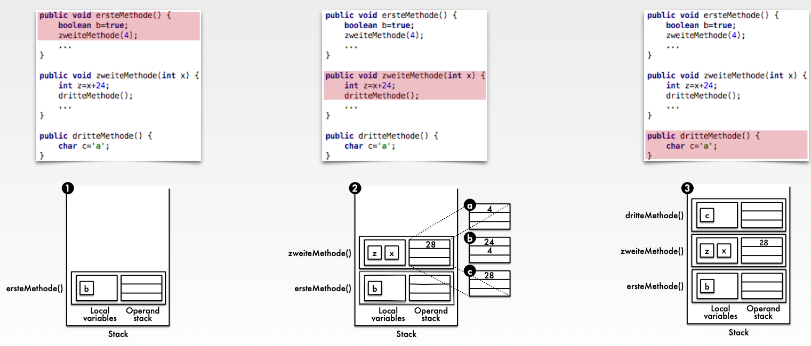
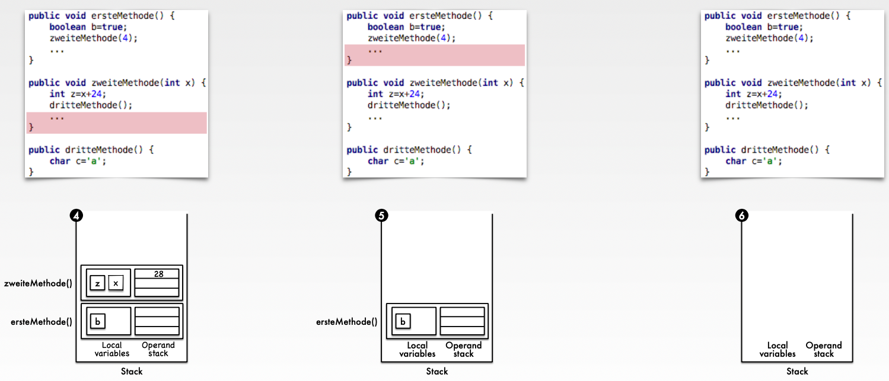
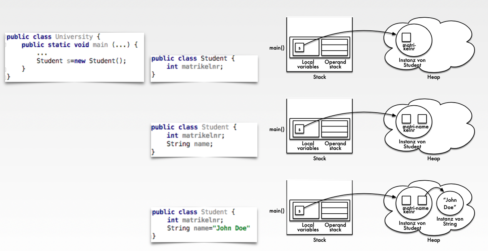
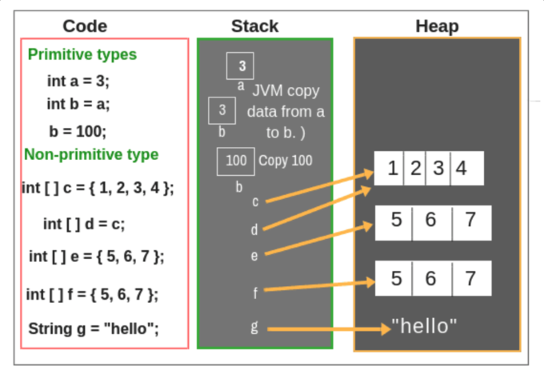

### Theory:

- Heap and Stack
    
    ### Stack (Stack memory):
    
    - Memory area allocated to a thread for storing local variables and intermediate results based on the LIFO (Last-In-First-Out) principle.
    - Highly efficient for storing and reading elements.
    - Grows and shrinks with the flow of the program.
    - No explicit memory release or garbage collection required.
    
    ### Heap (Heap memory):
    
    - Memory area assigned to a process and available to all threads of the process for storing objects, classes, and instance variables.
    - Elements are referenced through pointers.
    - Storing and reading elements is slow.
    - Memory must be explicitly released if no garbage collection is present.
    
    ### Stack in the Program:
    
    

    
    

    
    ### Heap in the Program:
    
    

    
    ### Stack vs. Heap
    
    

