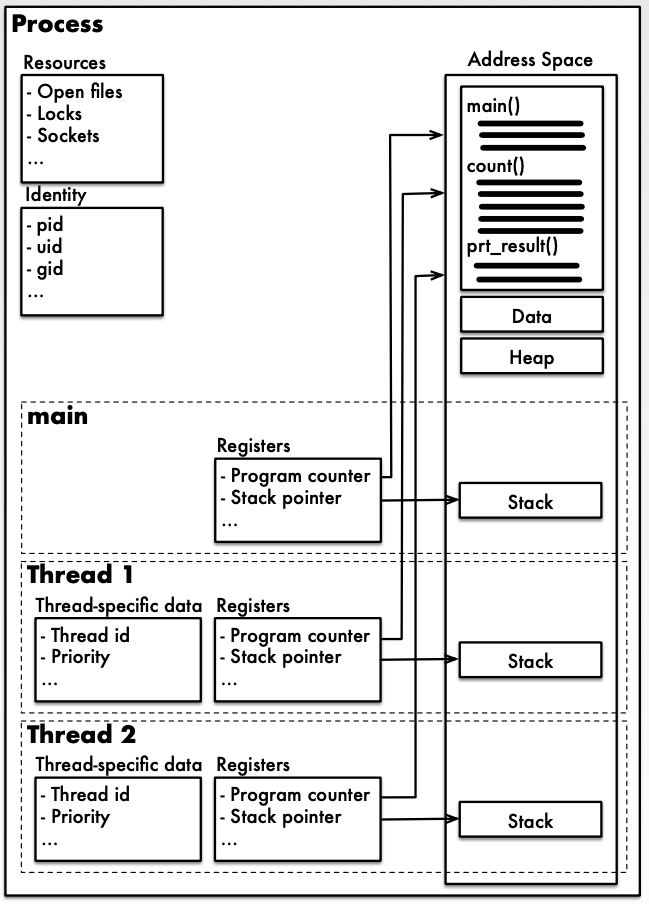
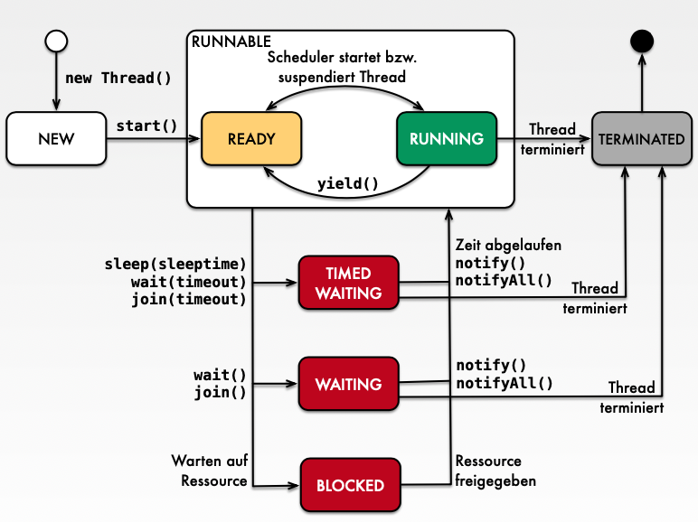

### Theory:

- Processes
    - Execution of a program in its process environment.
    - **Process Environment** (Execution Environment): Consists of the process context and associated resources.
    - **Resources** (Operating resources): CPU, memory, open files, consoles, network connections, etc.
    - **Process Context**: State of the address space, register contents, description of the associated resources.

- Threads
    - Parallel activity within a process.
    - Synonyms: Threads, Execution strands, Lightweight Processes.
    - The computational work of a process is divided into one or more activities which can run concurrently or in parallel.

- Characteristics of Processes
    - Each process has its own address space (virtual memory), which separates it from other processes in the system.
    - Every process contains at least one thread and can generate any number of threads.
    - Each process is assigned the resources it uses.
    

- Characteristics of Threads
    - Every thread belongs to a specific process.
    - Threads have states (e.g., Runnable, Waiting, Blocked).
    - Threads have their own control blocks and stacks.
    - All threads in a process share a common process environment.
    - Threads are not protected from other threads in the same process environment.

- Thread Life Cycle
    

